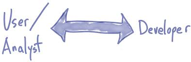
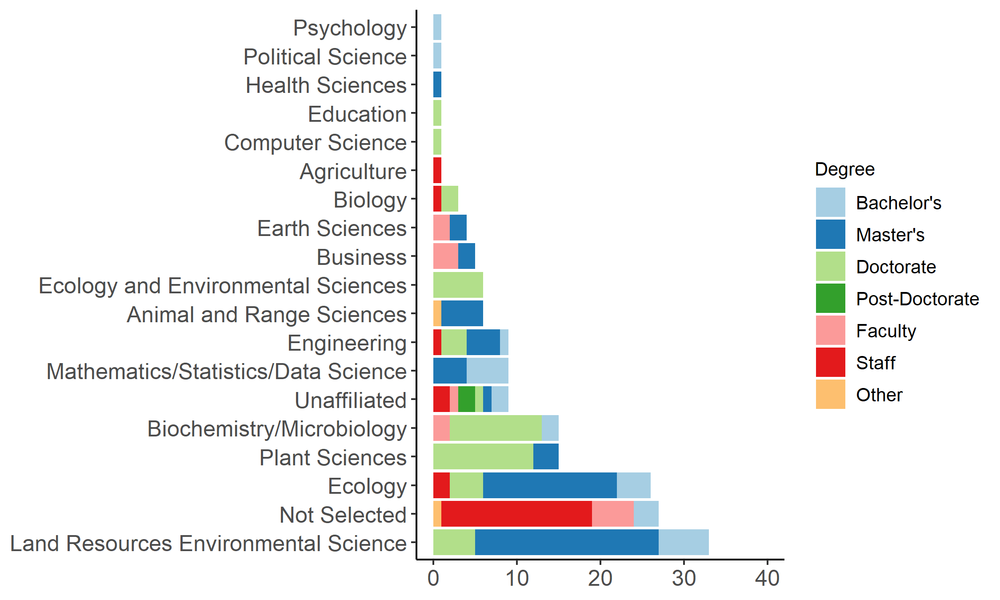
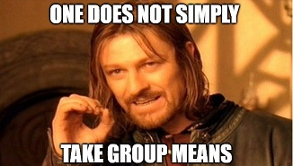

<style type="text/css">
slides > slide:not(.nobackground):after {
  content: '';
}
</style>

```{r setup, echo = FALSE, message = FALSE, warning = FALSE}
library(tidyverse)
library(knitr)
library(flair)
library(gridExtra)
library(viridis)
library(RColorBrewer)
library(forcats)

knitr::opts_chunk$set(warning = FALSE)
```

## Outline  

- Research Motivation
- History & Current Climate of Computing -- Statistics & Environmental Sciences
- Design, Implementation, and Evaluation of Data Science Workshops for 
Environmental Science Graduate Students  
- Considerations & Future Directions

## A Motivating Vignette  

- Suppose you are an Ecology graduate student studying the abundance of wild and
hatchery-raised pallid sturgeon. You have collected data over the last 2 years 
on fish abundance along the same reaches of the Missouri River, to look for 
trends in fish abundance.  

- When recording your data in Excel, you chose for each section of the Missouri 
to be a row and every sampling instance to be a different column.   

```{r, out.width = "600px", echo = FALSE, fig.align='center'}
knitr::include_graphics("figures/wide.jpg")
``` 

## Data Problems  

The `R` functions you saw in your courses require for your data to be in long 
format.

```{r, out.width = "500px", echo = FALSE, fig.align='center'}
knitr::include_graphics("figures/long.jpg")
``` 

## What Would You Do?  {.vcenter}

<div style="font-size:1.5em">

</br>
</br>

_Faced with this issue of data reorganizing, what would you do?_  

  _What resources would you use?_  


## Data-Intensive Research  

- Changing practice of environmental science has changed, because of growth in 
computational power and the volume and variety of available data. 

- Advances in technology have made computationally heavy applications of data 
science techniques essential understandings for environmental science research.

<!-- management and coalition of large data sets, high frequency spatial and temporal -->
<!-- data visualization, and hierarchical Bayesian modeling -->

- These advances have created a growing need for scientists to receive an 
appropriate education in computational methods and techniques relevant to their
discipline.  

## History of Computing -- Environmental Sciences 

- Andelman and colleagues (2000), reflected that their students were 
unprepared with both the statistical and computational skills necessary for 
data analysis.   

    * 93% of students did not have skills in the scripted programming languages 
    necessary for the integration of large data sets. 
    * The greatest limitation students faced was related to data concatenation,
    manipulation, and analysis.  

- Calls surfaced to re-evaluate the curriculum, to "better prepare current and 
future generations of environmental researchers" (Green et al., 2005).   


## (Lack of) Computing in Environmental Sciences  

- Strasser and Hampton (2012) explored the importance of data management in 
undergraduate ecology courses.  

    * Less than 20% of instructors included data management topics in their 
    courses, despite rating data management as a very important topic for their 
    research. 
    
<!-- such as workflows, databases, and reproducibility -->

- A 2012 survey of graduate students: 

    * over 80% of students reported that they had received no formal training in
    computing, even at the most basic level    
    * 74% stated that they had no skills in any programming language (Hernandez,
    Meyernik, Murphy-Mariscal & Allen, 2012).  
    
    
## Current Climate of Computing -- Environmental Sciences

- In 2017, environmental scientists produced a formative paper on the skills 
necessary for data-intensive environmental science research (Hampton et al.). 
    * data management and processing
    * data analysis
    * software skills for science
    * data visualization
    * communication methods for collaboration and dissemination

<!-- ``many if not most of [the] elements [of these areas] apply across multiple categories''  -->
    
<!-- - No attention is paid to the intersection between the computational skills  -->
<!-- required for data analysis and the other four key areas.  -->

<!-- No discussion is made regarding which computing skills are necessary across  -->
<!-- __every__ environmental science field and which skills may be unnecessary or  -->
<!-- purely tangential to some areas. -->


## Statistics and the Environmental Sciences  

- Environmental science educators reiterate the importance of data science 
skills for students' participation in "data-intensive" research. 

- None of these conversations pays attention to the role a students' 
statistics education plays in students' attainment of the computing skills 
necessary for data-intensive research. 

<!-- data management, visualization, and analysis -->

- Over the last twenty years, Statistics preparation in the environmental 
sciences has become  vital.  

    * Hence, Statistics courses have been incorporated into undergraduate and 
    graduate programs, across the nation.  
    
    
## History of Computing -- Statistics 

- "Computing has been one of the most glaring omissions in the set of tools that
have so far defined Statistics education" (Friedman, 2001).  

- Statistics' commitment to data modeling has prevented the field from entering 
new arenas where "the data being gathered is not suitable for analysis by 
data models" (Breiman, 2001, p. 200). 

<!-- Hence, Statisticians should become more familiar with  -->
<!-- algorithmic modeling, to address this significant change in the data landscape.  -->

- Brown and Kass argued that "to remain vibrant, [Statistics] must open up by 
taking a less restrictive view of what constitutes statistical training"
(Brown & Kass, 2009, p. 105).


## (Lack of) Computing in Statistics 

- "Most of our students are not prepared for data analysis after their 
statistics [courses]," because "they have done very little actual data analysis"
(Nolan & Temple Lang, 2010).  

- Students are either "told to learn how to program by themselves, from each 
other, or from their teaching assistant in a two-week "crash course" at the 
start of a course." 

<!-- * Sends a signal to students that computing is not of intellectual  -->
<!-- importance (Nolan & Temple Lang, 2010)   -->

- "What we teach [in Statistics] lags decades behind what we practice" and "the 
gap between our half-century-old curriculum and our contemporary statistical 
practice continues to widen" (Cobb, 2015).   


## Current Climate of Computing -- Statistics

<center>



</center>

- In 2005  the `ggplot2` was created, a midst the conversation for creating user 
friendly `R` tools (Wickham). 

- In 2012 `RMarkdown` was created, as an easy-to-use system for embedding code 
chunks in Markdown documents. 


<!-- * Breaking the copy-and-paste workflow of an antiquated user-interface  -->
<!-- design, promoting reproducibility of statistical analyses.  -->

<!-- With calls for transforming undergraduate statistics education resounding -->
<!-- nationally  -->
    
- In 2014 the American Statistical Association updated the guidelines for 
undergraduate programs in Statistics. 

<!-- The new guidelines included an increased emphasis on data science skills.  -->
<!-- 1. access and manipulate data in various ways -->
<!-- 2. use a variety of computational approaches to extract meaning from data  -->
<!-- 3. program in higher-level languages -->

- In 2017, the `tidyverse` package came into being, housing all of the packages
necessary for a clean data science workflow. 

<!-- import, tidy, transform, wrangle, visualize, and model data  -->

## Barriers to Incorporating Computing    

- This lack of training in computational skills impedes the progress of 
scientific research, sends the signal to students that computing is not of 
intellectual importance, and is laden with hidden costs. 

<!-- - This process potentially results in substantial hidden costs: -->
<!--     * students pick up bad habits and misunderstandings   -->
<!--     * learn just enough to get through      -->
<!--     * initial knowledge severely limits them  -->
<!--     * spend weeks or months on tasks that could be done in hours or days -->
<!--     * they may be unaware of the reliability and reproducibility of their results -->

- But why are these skills still so rarely included in the curriculum when the 
need for them is widely recognized?  

    * Courses are potentially taught by people who may not feel prepared teach 
    these topics. 
    * Attempting to fit more material into already-full courses and curricula. 
    * Not clear what computing topics should be included and how.  
    * Not all institutions have the flexibility to develop courses. 
<!-- for discipline specific computational techniques.    -->


## Resources for Learning `R` 

<!-- - Hampton and colleagues argue that "a symptom of the current curriculum's  -->
<!-- shortcomings is the recent emergence of a variety of extramural options for  -->
<!-- acquiring critical technological skills" (p. 547). -->

- The Carpentries: teaches foundational coding, and data science skills to 
researchers worldwide. In person, hands-on, two-day workshops, with publicly 
available lessons for specific populations of researchers. 

    * Software Carpentry 
    * Data Carpentry 
    
<!-- Since November 2011, we have taught over 16,000 learners in 1659 workshops in 51 countries, with over 500 instructors.     -->

- `swirl`: an `R` package which turns the `R` console into an interactive 
learning environment

<!-- Users receive immediate feedback as they are guided through self-paced lessons in data science and R programming  -->

- Data Camp: interactive `R`, Python, Sheets, SQL and shell courses. Paid online 
video lessons with coding challenges and projects.

<!-- The Carpentries workshops are open-source and developed by the public.  -->
<!-- They are intended to reflect the "fundamental" data skills needed to conduct  -->
<!-- research in the respective field.  -->

<!-- These resources may not reflect the computing needs of a specific community.  -->


## Research Questions  

1. What do environmental science faculty members identify as the key computing 
skills graduate students require to implement statistics for research in their 
field?   

2. How can the key computing skills identified by environmental science faculty 
be incorporated into currently existing workshop materials?  

3. What are the experiences of individuals attending data science workshops?  

4. Does the content of these workshops reflect the computing skills 
used by environmental science graduate students in their research?  


## Design-Based Implementation Research 

<!-- Improving environmental science graduate students' access to ``powerful,  -->
<!-- effective learning opportunities'' (Penuel) necessitates understanding the  -->
<!-- skills required for these students to be successful in their research. -->

- Design-based implementation research (DBIR) offers a model for the 
design and testing of innovations within learning contexts. 

    * Develops usable tools for improving teaching and learning in specific 
    subject matter domains and settings
    * Uses evidence-based improvements 
    
- The collaborative nature of design research positions members of the community
as "co-designers of solutions to problems" (Fishman et al., 2013, p. 140) rather
than bystanders. 


## Research Phases 

| Research Question | Design Phase | Data Collected |    
|:----------------|:------------:|:----------------:|  
| What do environmental science faculty members identify as the key computing skills graduate student require to implement statistics in environmental science research?  | Phase 1  | Faculty interviews |  
| How can the key computing skills identified by environmental science faculty be incorporated into currently existing workshop materials? | Phase 2  | Carpentries curriculum materials |  

## Phases Continued

Research Question | Design Phase | Data Collected |      
------------------|--------------|----------------|  
|What are the experiences of individuals attending data science workshops? | Phase 3 |  Pre- and post-workshop surveys|   
|Does the content of the workshops reflect the data science skills used by graduate students in their research? | Phase 3 | Collection of research (`R`) code |  


<div class="notes">

To investigate these questions, we executed a three-phase design-based
implementation research model.

In the first phase, we conducted in-depth interviews with faculty
from environmental science fields regarding the computational skills they 
believe are necessary for graduate students to succeed  in their research.

Phase two then focused on adapting currently existing  workshop resources to
design of a series of data science workshops targeting the key computational 
skills distilled from these interviews.

The final phase consisted of implementing the workshops and collecting survey  
responses from the workshop attendees regarding their experiences participating
in each workshop.

</div>

## Phase 1: Faculty Interviews

<!-- In the spring of 2017 and fall of 2018, faculty members from diverse  -->
<!-- fields within the environmental sciences were invited to participate in a  -->
<!-- one-hour interview. 

<!-- All faculty members currently overseeing a graduate student  --> 
<!-- from the Ecology, Land Resources Environmental Science, Animal \&  --> 
<!-- Range Sciences, and Plant Sciences \& Plant Pathology departments were emailed  --> 
<!-- requesting their participation in this research. -->

<font size="2">

|Department| Faculty Invited | Faculty Interviewed |  
|:---------|:---------------:|:-------------------:|  
|Animal & Range Sciences | 7  | 2 |  
|Ecology | 15 | 8 |  
|Land Resources Environmental Sciences | 24 | 8 |  
|Plant Sciences & Plant Pathology | 15 | 5 |  

</font>

- Faculty members from environmental science fields were interviewed 
regarding the computational skills they believed were necessary for graduate 
students to succeed in their research.   

## Computational Expectations

<!-- Computational expectations varied across fields of research, however, every  -->
<!-- faculty member emphasized:  -->

- Working with Data  
   * "Organize their data and get it in a way that can be used by `R`" 
    <!-- storing data, managing data, merging data, collating data, reorganizing data formats -->

- Data Visualization  
   * Ability to create visualizations of their data early and often  

- Reproducibility   
    * "Manipulating data in ways that are repeatable"  

- Data Context  
    * Importance of students acquiring computing skills in familiar data contexts     

## Expectations Acquiring Skills 

- Faculty voiced the expectation that students learn these skills on their own.    
    * "I think that more and more in our field my generation is sort of just 
catching up the next generation."  
    * "Increasingly faculty feel that way like they're they're not at the forefront
of the programming abilities and so their students are kind of being self-taught
and then are often ahead of them."  
    * "I feel personally out of touch, because [students] work in `R` and I 
haven't taken the time to learn `R`, because of my training and my age."


## Benefits of Statistical Computing Workshops

- Approachable training resources for researchers hoping to develop 
computational skills are scarce and "there is little space in the existing 
curriculum for courses or additional lectures" (Teal et al., 2015).   
    * Current resources assume learners have a basic level of understanding of 
working in `R`.  

- The Carpentries develop publicly available lessons for specific populations of
researchers. 
    * Does not assume that attendees have any prior knowledge before attending 
    the workshops
    <!-- * Allows for learners to sets a clear expectation for the pace of  -->
    <!-- instruction -->

- Workshops have the potential to scale more effectively than courses. 

## Workshop Development 

- In 2017, I developed a suite of four 3-hour data science workshops.  
    * The skills distilled from interviews with faculty members were infused 
    into Data & Software Carpentry `R` lessons. 
    * The interactive structure empowers researchers to conduct the computing 
    necessary for their analyses, in an effective and reproducible way.
<!-- when learning to program is embedded in exploring, making conjectures, and 
looking for evidence, students learn the computational concepts while building confidence -->
    * The environmental science context allows researchers to see immediately 
    how the computational skills they are learning directly relate to their own
    research. 

## `R` for Data Science Workshops    

- __Introduction to `R`__: objects in `R`, working in `R`, inspecting, 
extracting, wrangling, summarizing, and visualizing data with base `R` tools

- __Intermediate `R`__: relational and logical operators, conditional statements,
looping, and user-defined functions  

- __Data Wrangling in `R`__: data wrangling with `dplyr`, `stringr`, `forcats`, 
and `lubridate`, data organization with `tidyr`  

- __Data Visualization in `R`__: grammar of graphics with `ggplot2`

## Workshop Tools 

- RStudio 
    * Access to the resources of `R`, while providing you with a comfortable 
    working environment. 
    * Consistent across operating systems! 
<!-- Not the case for other statistical software packages. -->

<!-- The RStudio integrated development environment (IDE) includes a view of the  -->
<!-- workspace environment, a data browser, file browser, and plotting window,  -->
<!-- which makes it less intimidating than the bare `R` shell." -->

<!-- Because RStudio is an IDE, it includes integrated help files,  -->
<!-- intelligent code completion, and syntax highlighting---all of which help to  -->
<!-- reduce the learning curve.  -->

<!-- Additionally, RStudio makes reproducibility simple with dynamic `RMarkdown` -->
<!-- documents, allowing for a full integration of the data analysis workflow. -->

- RMarkdown Documents  
    * Allows attendees to keep their code organized and their workspace clean. 
    * Exploratory work is situated within each topic.  
  
<!-- For new learners, it is unnatural to create an organized script file with comments on each step.  -->
        
<!-- Helping workshop facilitators more easily debug any issues that may arise.    -->
<!-- When participants revisit their materials, the code they generated is neatly  -->
<!-- organized alongside the description of the process the code carries out.  -->
<!-- Decreases ramp-up time.  -->

- RStudio Cloud 
<!-- The RStudio Cloud was created as a platform to make it easy to do, share, -->
<!-- teach and learn data science using `R`.  -->
    * Publicly available workshop materials, without software or package 
    installation, or data transfers. 
    * Each workshop is contained in an organized `R` project directory. 
  
<!-- Interact with the workshop's materials in the same manner as a locally  -->
<!-- installed version of RStudio -->

<!-- Especially important during an introductory workshop, unexpected hiccups around  -->
<!-- package installation, data transfer, or the working directory do not arise.  -->
    
<!-- Attendees are exposed to best practices for reproducible project construction.  -->

<!-- All of the participants' changes are stored locally in their RStudio Cloud  -->
<!-- workspace, which they have the ability to access for years to come.  -->
<!-- Additionally, RStudio Cloud provides interactive tutorials covering key skills  -->
<!-- in learning to program in \texttt{R}.  -->

## Data Context

```{r, message = FALSE, warning = FALSE, echo = TRUE, tidy = TRUE}
fish <- read_csv("data/BlackfootFish.csv")

glimpse(fish)
```

## Introduction to `R` -- Working with Data 

```{r, echo = TRUE}
mean(fish$weight)
mean(fish$weight, na.rm = TRUE)
```

## Introduction to `R` -- Data Visualization

<div class="columns-2">

```{r hist, echo = FALSE, eval = FALSE, message = FALSE, warning = FALSE, fig.width = 3.5, fig.height = 5}
hist(fish$length, bins = 45)
```

```{r, echo = FALSE}
decorate("hist") %>%
  flair("hist")

```

```{r, echo = TRUE, message = FALSE, warning = FALSE, fig.width = 3, fig.height = 4.5}
hist(fish$length, bins = 45)
```

```{r scatter, echo = FALSE, eval = FALSE, echo = TRUE, fig.width = 4.5, fig.height = 5}
plot(weight ~ length, data = fish)
```

```{r, echo = FALSE}
decorate("scatter") %>%
  flair("plot")

```

```{r, echo = FALSE, echo = TRUE, fig.width = 4.5, fig.height = 5}
plot(weight ~ length, data = fish)
```

</div>

## Intermediate `R`  

__Subsetting__

```{r subset, echo = FALSE, results = 'hide'}

subset(fish, !is.na(weight) & species == "RBT")

rbt <- subset(fish, species == "RBT", select = -species)
```

```{r, echo = FALSE}
decorate("subset") %>%
  flair_rx("select", background = "pink") 

```

__Repeating Operations__

```{r, echo = TRUE}

condition_fun <- function(w, l){
  condition = (w^(1/3) / l)*50
  return(condition)
}
  
for(i in 1:dim(rbt)[2]){
  rbt$condition[i] <- condition_fun(rbt$weight[i], 
                                rbt$length[i])
}
```

## Data Wrangling with `dplyr` and `tidyr` 

```{r wrangling, echo = FALSE, results = "hide"}

fish %>% 
  filter(!is.na(weight), 
         species == "RBT") %>%
  select(-species) %>% 
  mutate(condition = condition_fun(weight, length)) %>% 
  head()

```

```{r, echo = FALSE}
decorate("wrangling") %>%
  flair_rx("select", background = "pink") %>% 
  flair_rx("filter", background = "pink") %>% 
  flair_rx("%>%", background = "Aquamarine") 

```

```{r, echo = FALSE}

fish %>% 
  filter(!is.na(weight), 
         species == "RBT") %>%
  select(-species) %>% 
  mutate(condition = condition_fun(weight, length)) %>% 
  head()

```

## Data Visualization with `ggplot2` 

```{r, echo = FALSE}
decorate("wl <- fish %>%
        ggplot(aes(x = length, y = weight, color = species)) + 
        geom_point()
len <- fish %>% 
        ggplot(aes(x = length)) + 
        geom_histogram(bins = 45)
grid.arrange(wl, len, nrow = 2, widths = c(6, 4))
") %>%
  flair_rx("%>%", background = "Aquamarine") %>% 
  flair("geom_point") %>% 
  flair("geom_histogram")
```

```{r, echo = FALSE, warning = FALSE, fig.width = 10, fig.height = 6}
wl <- fish %>%
        ggplot(aes(x = length, y = weight, color = species)) + 
        geom_point()
len <- fish %>% 
        ggplot(aes(x = length)) + 
        geom_histogram(bins = 45)
grid.arrange(wl, len, nrow = 2, widths = c(6, 4))
```

## Workshop Attendance by Department 

```{r, echo = FALSE, message = FALSE, warning = FALSE}

intro_ws <- read_csv("data/intro_clean_AY19.csv")

intermediate_ws <- read_csv("data/intermediate_clean_AY19.csv")

wrangling_ws <- read_csv("data/wrangle_clean_AY19.csv")

visualization_ws <- read_csv("data/data_viz_clean_AY19.csv")


all_ws <- full_join(intro_ws, 
                    intermediate_ws, 
                    by = intersect(colnames(intro_ws), 
                                   colnames(intermediate_ws)), 
                    copy = FALSE) %>%
  full_join(wrangling_ws, 
            by = intersect(colnames(.), colnames(wrangling_ws)), 
            copy = FALSE) %>% 
  full_join(visualization_ws, 
            by = intersect(colnames(.), colnames(visualization_ws)), 
            copy = FALSE) %>% 
  select(-X1, -agree, -workflow)


all_ws <- all_ws %>% 
  rename(workshop = ws) %>% 
  mutate(store_data = ifelse(store_data == "", "Other", store_data)) %>% 
  mutate(degree = case_when(grepl('[Ii] am a [Ff]aculty', degree) ~ "Faculty", 
                            grepl('[Pp]ost', degree) ~ "Post-Doctorate",
                            grepl('[Ii] am a [Ss]taff', degree) ~ "Staff",
                            grepl('Staff Member', degree) ~ "Staff", 
                            TRUE ~ degree)) %>%
  mutate(program = case_when(grepl('[Ss]taff', program) ~ 
                               "Unaffiliated", 
                             grepl('[Mm]athematics/[Ss]tatistics', program) ~ 
                               "Mathematics/Statistics/Data Science",
                             grepl('LRES', program) ~ 
                               "Land Resources Environmental Science",
                             is.na(program) ~ "Not Selected",
                             program == "Other" ~ "Unaffiliated",
                             TRUE ~ program)) %>% 
  mutate(degree = case_when(is.na(degree) ~ "Other",
                            degree == "Bachelors" ~ "Bachelor's", 
                            TRUE ~ degree)) %>% 
  mutate(coursework_help = case_when(grepl('Coursework', reason_attend) ~ "Coursework Assistance", 
                                     TRUE ~ "NA")) %>%
  mutate(prof_recommend = case_when(grepl('Professor', reason_attend) ~ 
                                      "Department/Professor Recommended", 
                                    TRUE ~ "NA")) %>%
  mutate(prof_develop = case_when(grepl('Professional', reason_attend) ~ 
                                    "Professional Development", 
                                  TRUE ~ "NA")) %>%
  mutate(research_help = case_when(grepl('[Rr]esearch', reason_attend) ~ 
                                     "Research Assistance", 
                                   TRUE ~ "NA")) %>% 
  mutate(workshop = case_when(workshop == "introR" ~ "Introduction to R", 
                        workshop == "intermediateR" ~ "Intermediate R", 
                        workshop == "wranglingR" ~ "Data Wrangling in R", 
                        workshop == "Data Visualization" ~ "Data Visualization in R"))

```

```{r, echo = FALSE, message = FALSE, warning = FALSE, eval = FALSE}
dept_levs <- c("Land Resources Environmental Science", 
               "Not Selected", 
               "Ecology", 
               "Plant Sciences", 
               "Biochemistry/Microbiology", 
               "Unaffiliated", 
               "Mathematics/Statistics/Data Science", 
               "Engineering", 
               "Animal and Range Sciences", 
               "Ecology and Environmental Sciences", 
               "Business", 
               "Earth Sciences", 
               "Biology", 
               "Agriculture", 
               "Computer Science", 
               "Education", 
               "Health Sciences", 
               "Political Science", 
               "Psychology")
  
degree_levs <- c("Bachelor's","Master's", "Doctorate", "Post-Doctorate", "Faculty", "Staff", "Other")

## Programs of Study
attendance <- all_ws %>%
  mutate(program = as.character(program)) %>% 
  rename(Department = program, Workshop = workshop, Degree = degree) %>% 
  mutate(Degree = factor(Degree, levels = degree_levs), 
         Department = factor(Department, levels = dept_levs)) %>% 
  group_by(Department, Degree) %>%
  summarize(Freq = n()) %>% 
  group_by(Department) %>% 
  arrange(desc(Freq)) %>% 
  
  ggplot(mapping = aes(x = Department, y = Freq, fill = Degree)) + 
  coord_flip() + 
  geom_bar(stat = "identity") + 
  ylim(0, 40) +
  #geom_text(aes(label = Freq, y = Freq + 1), vjust = 0, size = 10) +
  theme_classic() +
  theme(axis.title.y = element_blank(), 
        axis.text.y = element_text(size = 12),
        axis.title.x = element_blank(),
        legend.position = "right", 
        legend.text = element_text(size = 10), 
        legend.title = element_text(size = 10)) + 
  scale_fill_brewer(palette = "Paired") 

ggsave("figures/attendance.png", attendance, dpi = 300)

```

```{r, out.width = "850px", out.height = "475px", echo = FALSE}



```


## Workshop Attendance by Topic

```{r, echo = FALSE}
all_ws %>% 
  group_by(workshop) %>% 
  summarize(Freq = n()) %>% 
  arrange(desc(Freq)) %>% 
  kable(col.names = c("Workshop", "Attendees"))
```

<!-- Many participants attend subsequent workshops, but nearly 60% only attended the -->
<!-- Introduction to R workshop.  -->


## Computing Backgrounds of Attendees

```{r, echo = FALSE, eval = FALSE}
all_ws <- 
  all_ws %>% 
  mutate(python = ifelse(str_detect(languages, "Python"), 
                         "Yes", 
                         "No"),
         R = ifelse(str_detect(languages, "R"), 
                         "Yes", 
                         "No"),
         C = ifelse(str_detect(languages, "C++"), 
                         "Yes", 
                         "No"),
         matlab = ifelse(str_detect(languages, "MatLab"), 
                         "Yes", 
                         "No"),
         java = ifelse(str_detect(languages, "Java"), 
                         "Yes", 
                         "No"),
         fortran = ifelse(str_detect(languages, "Fortran"), 
                         "Yes", 
                         "No"),
         no_languages = case_when(str_detect(languages, "None") ~ 
                                    "None",
                                  str_detect(languages, 
                                             "What is a programming language?") ~
                                    "Unfamiliar"),
         other_language = ifelse(str_detect(languages, "Other"), 
                         "Yes", 
                         "No"),
         SQL = ifelse(str_detect(languages, "SQL"), 
                         "Yes", 
                         "No")
  )


all_ws %>% 
  gather(python:SQL, key = "language", value = "familiar") %>% 
  filter(familiar == "Yes" | familiar == "Unfamiliar" | familiar == "None") %>% 
  group_by(language) %>%
  count(n = n()) %>% 
  arrange(desc(n))  
```


|Programming Language(s)         | Attendees |  
|:-------------------------------|:----------|  
| None                           |  74       |  
| `R`                            |  36       |  
| Python                         |  31       |  
| Java or Javascript             |  14       |  
| SQL                            |  13       |  
| C or C++                       |  10       |  
| Fortran                        |  5        |  


## Statistical Backgrounds of Attendees

| Statistics Course(s)           | Attendees |  
|:-------------------------------|:----------|  
| Introductory Statistics        |  46       |  
| Applied Statistics             |  42       |  
| None                           |  24       |  
| Discipline Specific Intro Stat |  20       |  
| Intermediate Statistics        |  10       |  
| Experimental Design            |  8        |  
| Probability Theory             |  6        |  


## Reasons for Attending Workshops

```{r, echo = FALSE, eval = FALSE}
all_ws <- 
  all_ws %>% 
  select(-coursework_help:-research_help) %>% 
  mutate(
    grad_or_career_prep = ifelse(
      str_detect(
        tolower(reason_attend),
        "grad|career|job"), 
      "Yes", 
      "No"), 
    adviser_recommend = ifelse(
      str_detect(
        tolower(reason_attend), 
        "adviser"), 
      "Yes", 
      "No"), 
    dept_recommend = ifelse(
      str_detect(
        tolower(reason_attend),
        "department"), 
      "Yes", 
      "No"), 
    flier = ifelse(
      str_detect(
        tolower(reason_attend),
        "flier"), 
      "Yes", 
      "No"), 
    network = ifelse(
      str_detect(
        tolower(reason_attend),
        "network"), 
      "Yes", 
      "No"), 
    refresh_update = ifelse(
      str_detect(
        tolower(reason_attend),
        "refresh|brush up|broaden|improve|know more"), 
      "Yes", 
      "No"), 
    professional_develop = ifelse(
      str_detect(
        tolower(reason_attend),
        "professional|students|develop"), 
      "Yes", 
      "No"
    ), 
    research_help = ifelse(
      str_detect(
        tolower(reason_attend),
        "research|analyze"), 
      "Yes", 
      "No"), 
    coursework_help = ifelse(
      str_detect(
        tolower(reason_attend),
        "course|stat"), 
      "Yes", 
      "No")
    
)

all_ws %>% 
  gather(grad_or_career_prep:coursework_help, key = "reason", value = "agree") %>% 
  filter(agree == "Yes") %>% 
  group_by(reason) %>% 
  count(n = n()) %>% 
  arrange(desc(n))  
```

| Reason(s) Attended              | Attendees |  
|:--------------------------------|:----------|  
| Research Assistance             | 58        |  
| Coursework Assistance           | 36        |  
| Saw a Flier                     | 23        |  
| Refresh or Update Skills        | 17        |  
| Preparation for Graduate School | 14        |  
| Department Recommended          | 13        |  
| Adviser Recommended             | 6         |  
| Professional Development        | 6         |   


## Resources Used to Learn `R` 

```{r, echo = FALSE, eval = FALSE}
all_ws <- 
  all_ws %>% 
  mutate(
    no_resources = case_when(
      resources == "?" ~ 
        "Yes", 
      str_detect(
        tolower(resources),
        "n/a|haven't learned|haven't used yet|none") ~ 
        "Yes"
      ), 
    previous_workshops = ifelse(
      str_detect(
        tolower(resources),
        "your|these courses|this course|this workshop"), 
      "Yes", 
      "No"), 
    adviser_resource = ifelse(
      str_detect(
        tolower(resources),
        "adviser"), 
      "Yes", 
      "No"), 
    course_resources = ifelse(
      str_detect(
        tolower(resources),
        "course material"), 
      "Yes", 
      "No"), 
    book_resources = ifelse(
      str_detect(
        tolower(resources),
        "books"), 
      "Yes", 
      "No"), 
    lab_resources = ifelse(
      str_detect(
        tolower(resources),
        "lab mates"), 
      "Yes", 
      "No"), 
    peer_resources = ifelse(
      str_detect(
        tolower(resources),
        "peers"), 
      "Yes", 
      "No"), 
    professor_resources = ifelse(
      str_detect(
        tolower(resources),
        "professor"), 
      "Yes", 
      "No"), 
    internet_resources = ifelse(
      str_detect(
        tolower(resources),
        "internet|youtube"), 
      "Yes", 
      "No")

  )

all_ws %>% 
  gather(no_resources:internet_resources, key = "resource", value = "used") %>% 
  filter(used == "Yes") %>% 
  group_by(resource) %>% 
  count(n = n()) %>% 
  arrange(desc(n))  

```

| Resources Used                  | Attendees |  
|:--------------------------------|:----------|  
| Internet Resources              | 55        |  
| Course Resources                | 45        |  
| Peers                           | 43        |  
| Lab Mates                       | 29        |  
| Adviser                         | 21        |  
| None                            | 7        |  
| This Workshop Series            | 5         |  
| Books                           | 3         |   


## Do These Skills Capture What Researchers Use?

- Collection of the `R` code generated by environmental science graduate 
students provides insight into the key data science skills necessary for 
research in these fields 

- Aids in reevaluating the content of these workshops, to ensure they cover the
skills necessary for graduate-level environmental science research.

## Working in `R`   

- Using `R` projects to promote better workflow practices  
    * Working directories
    * Organized folder directory 

- Using `RMarkdown` documents to promote better script writing 
    * Organized sections of code 
    * Allows for written descriptions 
    * Promotes reproducibility

<!-- With novice R programmers, R scripts can end up looking like a junk drawer,  -->
<!-- with no organization and irrelevant content. -->
 
    
## Working with Data in `R` 

- Handing a variety of data structures 

- Wrangling data  
    * Selecting columns 
    * Filtering rows or elements
    * Creating new variables
    * Mutating existing variables

## Control Flow 

- Conditional statements
    * Mutating existing variables
    * Function breaks 

- Repeated operations 
    * Sequences of steps being copied-and-pasted 
    * Looping 
    * Vectorization 
    
- User-defined functions 
    * Function scoping
    
## Data Presentations  

- Data summaries 
    * Means of groups 
    * 
    
- Data visualizations  
    * Adding facets 
    * Plotting specifications

## Dissemination of Research 

- Infusing the skills outlined by this research into Data Carpentry's _Data Analysis and Visualization in `R` for Ecologists_ curriculum

- Creating lessons through the Carpentries Incubator and Carpentries Lab
    * Focusing on teaching the skills outlined by this research, not currently
    included in the Carpentries curriculum

## Considerations & Future Directions

- Attendance of these workshops by individuals outside of environmental science
disciplines brings to question if this type of tailored design work is 
necessary. 

<!-- Over a third of the workshop attendees came from disciplines outside of  -->
<!-- environmental sciences.  -->

<!-- Strikingly, these attendees reported similar workshop experiences to attendees  -->
<!-- from these targeted disciplines. -->

- Are there common data science skills necessary for research in __any__ 
scientific field? 
 
- A larger number of attendees from environmental science fields persisted 
across workshops.   
    * What are the drivers behind these individuals' continued attendance?
    * Investigating the learning outcomes of workshop attendees could provide 
    insight into the necessity of these discipline-specific learning 
    opportunities. 

## Many Thanks

- Stacey Hancock   
- Mary Alice Carlson, Jenny Green, & Megan Wickstrom 
- Sara Mannheimer & Mark Greenwood
- Workshop Facilitators and Helpers 
- Environmental Science faculty and graduate students


## References 

<center> 

</br>
</br>


http://bit.ly/theobold_kopriva


## What is `R`? 

- It's a dialect of S!   

- "`R` is a free software environment for statistical computing and graphics." 

- "The `tidyverse` is an opinionated collection of R packages designed for data science."

- Created because the commonly used data analysis packages had some key 
downsides: 
    * Graphics were too “quick and dirty” 
    * Relatively little ability to build custom tools 

- `R` solved these two key problems. 

## Why `tidyverse`?

```{r}
sample_n(airquality, 8)
```

## Means of Groups -- `tidyverse`

```{r, eval = FALSE}
group_by(airquality, Month) %>% 
  summarize(o3 = mean(Ozone, na.rm = TRUE))
```

```{r}
aggregate(airquality, 
          list(Month = airquality[, "Month"]), 
          mean, 
          na.rm = TRUE)
```

## Why so complicated? 

```{r, eval = FALSE}
aggregate(airquality, 
          list(Month = airquality[, "Month"]), 
          mean, 
          na.rm = TRUE)
```

1. What are the square brackets `[` for ? 
<!-- They are used for subsetting a data frame. -->

2. What is `list()`? 
<!-- It’s a type of R object. -->

3. Why is the `mean()` function just sitting there all by itself? 
<!-- It is being passed to the subsets of the data frame via a kind of internal lapply(). (Follow up: What is lapply()?) -->

4. Is `na.rm = TRUE` an argument to aggregate()? 
<!-- No, it is an argument to mean(), but it is being passed to mean() via the ... argument of aggregate(). -->


